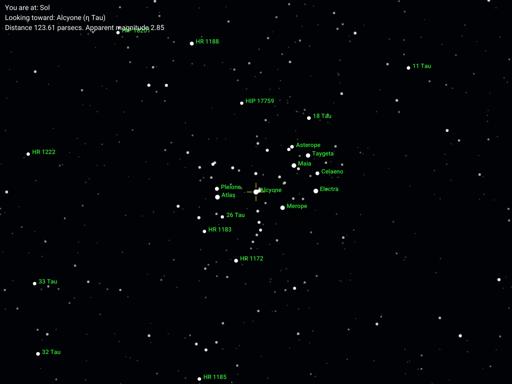
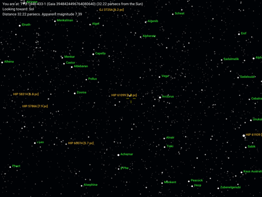
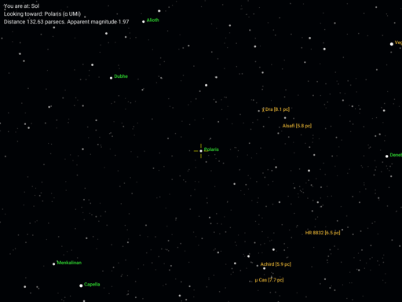
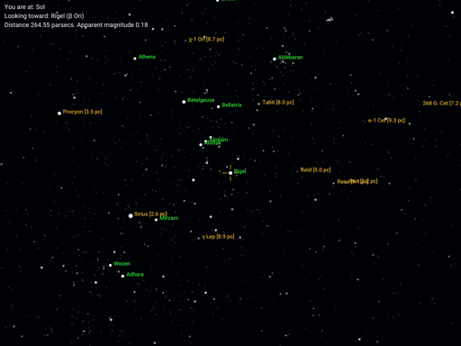
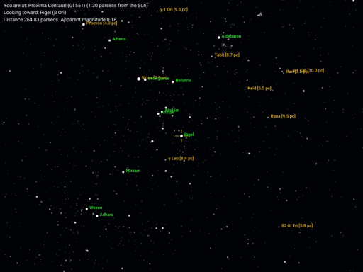

# uraniborg <a id="uraniborg-title"></a>

`uraniborg` is a CLI visualization tool and star chart "engine" for the Augmented Tycho + HYG (AT-HYG) star catalog. The [AT-HYG catalog](https://codeberg.org/astronexus/athyg) consists of stars from the Tycho-2 star catalog, augmented with additional distance and velocity information from Gaia DR3, as well as the "classic" / historical information from the [HYG catalog](https://codeberg.org/astronexus/hyg).

`uraniborg` lets you view the sky from both the solar system and from any star in the AT-HYG catalog with a known distance (over 2.5 million stars currently). 

## Table of Contents <a id="table-of-contents"></a>

- [Background](#background)
    - [Inspiration](#inspiration)
    - [Sample Charts](#sample-charts)
- [Getting Started](#getting-started)
    - [Installation](#installation)
        - [Simple](#simple-install)
        - [Custom](#custom-install)
    - [Quick Start](#quick-start)
        - [Starting Configuration](#starting-configuration)
        - [Creating Charts](#creating-charts)
    - [Slightly More Detailed Start](#more-detailed-start)
- [Creating New Chart Configurations](#configurations)
- [Documentation](#documentation)

<a id="background"></a>

## Background

<a id="inspiration"></a>

### Inspiration
> "...the _Millennium Star Atlas_, as seen from every star _in_ the _Millennium Star Atlas_ ..."

The idea for `uraniborg` came after building and maintaining the HYG catalog for many years and extending its data source to Tycho-2 in the AT-HYG (Augmented Tycho + HYG) catalog, which is more than 20 times the size of the original HYG. AT-HYG justified an application that could use a larger data set than HYG, while retaining the capabilities like the ability to show the sky from any star in the catalog.

AT-HYG uses the Gaia Data Release 3 (https://www.cosmos.esa.int/web/gaia/dr3) as its primary source for 3D position and velocity data. About 98% of stars in Tycho-2 (over 2.5 million) have accurate Gaia DR3 distances, and about 90% also have accurate velocity data in all three dimensions from Gaia DR3. As a result, `uraniborg` can show the sky as it appears:

- at the current epoch (J2000.0): from about 20 times as many stars as a purely HIPPARCOS-based catalog
- at times up to several hundred thousand years past and future: from about 18 times as many stars as a purely HIPPARCOS-based catalog

In particular, it can show every star included in the classic large-format star atlas, the _Millennium Star Atlas_, since the primary data source for this atlas was the Tycho-2 data set. Since nearly every star in Tycho-2 now has a precise distance determined in Gaia DR3, `uraniborg` can draw a chart in the style of the _Millennium Star Atlas_, as seen from every star _in_ the _Millennium Star Atlas_, as well as many other styles of chart.

[Back to Table of Contents](#uraniborg-title)

<a id="sample-charts"></a>

### Sample Charts

Here are a couple of representative outputs of `uraniborg`. Click on the small image to view the full-sized chart as actually rendered:

1. The Pleiades star cluster showing stars to magnitude +11.0.

[](./examples/samples/pleiades.png "The Pleiades as seen from the Sun.")

2. Looking back towards the Sun from HD 110087 (a.k.a. TYC 1448-433-1), a star in the news for [having 6 exoplanets in strikingly stable orbits.](https://en.wikipedia.org/wiki/HD_110067) The Hyades are in the upper left, and there are several other bright stars in the area to make some nice alien constellations from.

[](./examples/samples/sol_from_tyc_1448_433_1.png "View from HD 110087/TYC 1448-433-1")

There are additional sample charts in the file ["examples/SAMPLES.md"](./examples/SAMPLES.md).

[Back to Table of Contents](#uraniborg-title)

<a id="getting-started"></a>

## Getting Started

<a id="installation"></a>

### Installation

`uraniborg` is written in Go (https://go.dev/). Version 1.21 or later is required.

The installation instructions below are for a Linux or macOS terminal, and assume you have already installed a sufficiently recent version of Go. For Windows, use the corresponding commands for the steps below.

<a id="simple-install"></a>

#### Simple Installation and Startup

Do this to get a quick feel for `uraniborg` without additional setup.

1. Clone the repository.

    See ["docs/CONTENTS.md"](docs/CONTENTS.md) for an overview of the major directories and files in the repository.

2. Uncompress the sample data file in `data/athyg_32_subset.csv.gz` using a gzip-capable uncompression program:

    `gunzip data/athyg_32_subset.csv.gz`

3. From the main directory, enter:

    `go build`

    This generates an executable in the main directory. You can then run the executable by running

    `uraniborg` 
 
    within this directory.

[Back to Table of Contents](#uraniborg-title)

<a id="custom-install"></a>

#### Custom Installation and Startup

By default, `uraniborg` looks in the same directory it's installed in for support files, like configuration files, font files, and data files. These live in specific directories in the cloned git repository. Hence, the Simple Installation just builds `uraniborg` within the repository directory structure and leaves everything else alone.

You can have the executable and the support file directories exist in separate locations. For example, you can install `uraniborg` to a directory of your choosing, like the one used by `go install` on your system, without having to move the entire repository to the location of the executable. Alternatively, you may want to have a copy of the support files in a more convenient location than the cloned repository.

To install `uraniborg` to a different directory from the one containing its support files, you'll need to do these things:

1. Install the executable to the desired location (e.g., to `~/go/bin`) via `go install` (or `go build` and then copying to the desired directory)
2. (optional, if you also want to use a different location for the support files) Move or copy the following directories from the `uraniborg` repository to the desired location outside the executable's directory:
    - `charts`: The directory chart images get written to.
    - `config`: The location of the user and application configuration file, config presets, and schemes.
    - `data`: The location of the data files for charts. 
    - `fonts`: the directory containing fonts used in charts.

For example, you might set up the directory `~/documents/uraniborg` for this purpose, and then have `~/documents/uraniborg/charts` (etc.) as your working directories for `uraniborg` support files.

3. As in the Simple Installation, uncompress the sample data file in `data/athyg_32_subset.csv.gz` using a gzip-capable uncompression program.
4. Run the executable with the command-line flag `-b`, followed by the full path to the desired support file directory. `-b` specifies the **b**ase directory for all of these support files.

A worked example, assuming you have installed `uraniborg` to a directory already in your path, the custom location for support files is `~/docs/uraniborg`, and you have kept the same names for the support file directories there:

```
export URANIBORG_DOCS=~/docs/uraniborg
alias ub="uraniborg -b $URANIBORG_DOCS
```

Then, running

`ub`

from any directory will start `uraniborg` with the information in your `~/docs/uraniborg` directory.

[Back to Table of Contents](#uraniborg-title)

##### Customizing Directories for Support Files

The instructions above assume you have not changed the names of the support file subdirectories, like `charts` and `fonts`, after you have moved or copied them elsewhere. If you have changed these names, you'll need to specify the new name with an additional command line flag:

- `-c`: Path to the configuration file directory
- `-d`: Path to the data file directory
- `-f`: Path to the font directory
- `-i`: Path to the images (generated charts) directory.

So, for example, if your new charts directory is called `images` instead of `charts`, you'd do something like this:

```
export URANIBORG_DOCS=~/docs/uraniborg
alias ub="uraniborg -b $URANIBORG_DOCS -i images
```

and then running `ub` will tell `uraniborg` to start up and use `~/docs/uraniborg/images` for generated charts.

[Back to Table of Contents](#uraniborg-title)

<a id="quick-start"></a>

### Quick Start

`uraniborg` is event-driven, specifically detecting changes (disk writes or saves) to a configuration file that defines the information needed to create a chart. By default, this file is `config/main.yaml` in your working directory for `uraniborg` configuration files. So to create charts, you need to do two things:

1. Start `uraniborg` and leave it running.
2. Edit the configuration file with new parameters and save it.

<a id="starting-configuration"></a>

#### Starting Configuration

The `main.yaml` configuration file covers all sort of chart aspects, such as what star is the "viewpoint", where the chart is centered, how large the chart is, etc. There are over a dozen different options you can set. 

Since this is a Quick Start, that's more complexity than is needed at first. To keep that complexity down at the start, `uraniborg` provides a set of "preset" configurations, which have all the options set for a certain type or style of chart. These are discussed in more detail a little further on. For right now, just be aware the starting configuration file has a `preset` value set (`mag_6`), so it will load that specific "stock" configuration for you. `mag_6` sets up a view for stars down to 6th magnitude, about the limit of naked-eye visibility under a fairly dark sky.

As a result, the only configuration items you need to change are:

- The star the chart is to be generated from. That is, the location whose sky you want to see.
- The star the chart is centered on (as seen from that viewpoint, chosen above).

The starting configuration file (`config/main.yaml`) has examples of these already set:

```
to: Polaris
from: Sol
```

- The `to` value is the "target" for the chart: it's the star that appears in the exact center. In the starting configuration, it's Polaris, the North Star in Ursa Minor. 
- The `from` value is the "viewpoint" for the chart, or the star you are viewing the chart from. In the starting configuration, it's Sol, or the Sun, so this will be the sky as familiar from here on Earth.

[Back to Table of Contents](#uraniborg-title)

<a id="creating-charts"></a>

#### Creating Charts

Every time you change the configuration and save it to disk, `uraniborg` creates an updated chart. By default, charts are created in the file `charts/output.png`.

If you've already started `uraniborg` as part of installation, you should be ready to go. Otherwise, start it by running the executable file.

After `uraniborg` has started up (it takes a few seconds to initialize and load data) it will generate its first chart using the intial `config/main.yaml` file from the git repository. That chart resulting from the very first startup, with the configuration items described above, should look like this (click to enlarge):

[](./examples/samples/polaris.png)

Polaris, the `to` star, is centered. You can also see Cassiopeia in the lower right, and part of the Big Dipper (Ursa Major) in the upper left.

Now try editing the `config/main.yaml` file. For starters, leave the `from` star alone (so it's still our Sun), and then pick any `to` star you're familiar with, such as a bright star like 'Rigel' or 'Vega', or a very nearby one like 'Proxima Centauri'. 

Save the configuration file and examine `charts/output.png`. The result should be the familiar night sky around your chosen `to` star.  As an example, if you chose Rigel as the `to` star, with this config:

```
to: Rigel
from: Sol
preset: mag_6
```

you'd get this chart (click to enlarge):

[](./examples/samples/rigel.png)

The chart is now centered on the star Rigel, as seen from the Sun.

Next, edit the `config/main.yaml` file to use the closest star to the Sun, Proxima Centauri, as the `from` viewpoint. Again, if you chose
Rigel as the `to` star, you'd have:

```
to: Rigel
from: Proxima Centauri
preset: mag_6
```

Save the file and examine `charts/output.png` again. Again using Rigel as an example, it will look like this:

[](./examples/samples/rigel_from_proxima.png)

The chart is now centered on the star Rigel, as seen from Proxima Centauri. You should see _mostly_ familiar constellations, but with some of the stars a bit out of place, because you've moved the `from` location to another star. In the case of Rigel, for example, the bright star Sirius has moved from its familiar location in Canis Major to a position very close to Betelgeuse in Orion.

You now know how to create a star chart showing the sky from any star in the included catalog.

[Back to Table of Contents](#uraniborg-title)

<a id="more-detailed-start"></a>

### Slightly More Detailed Start
The `from` and `to` identifiers for the stars can be any of the following identifiers (all are non-case-sensitive):

- any common name recognized by the IAU (https://www.iau.org/public/themes/naming_stars/), such as "Sirius" or "Polaris"
- "Sun" or "Sol" to indicate our home star
- the Bayer Greek-letter designation, e.g. "alpha UMa". 
    - Constellation identifiers may be the full name (e.g. "Ursa Major"), the Latin genitive form (e.g. "Ursae Majoris"), or one of [the official 3-letter abbreviations](https://en.wikipedia.org/wiki/IAU_designated_constellations#Abbreviations). 
    - The names and abbreviations are not case sensitive: "alpha uma" or "alpha ursae majoris" are also fine.
- the Flamsteed number designation, e.g. "61 Cyg"
    - Constellation identifiers follow the same guidelines as for Bayer Greek-letter designations.
- the HIPPARCOS ID with a "HIP" prefix, e.g. "HIP 16537"
- the Harvard Revised (HR) number from the Yale Bright Star Catalog, with an "HR" prefix, e.g. "HR 1008"
- the Tycho-2 ID with a "TYC" prefix, e.g. "TYC 5296-1533-1". Remove leading zeros from the three sub-IDs making up the full ID, if there are any.
- the Gaia DR3 ID as just a number, e.g. "5164707970261890560"

The `preset` name can be any of over a dozen prepackaged sets of configuration, defined in the `config/presets` directory. 

For getting more familiar with `uraniborg`, the `mag_x` presets are a good place to start. They range from `mag_5`, which resembles a suburban sky, to `mag_12`, which resembles the view in a small (about 4" or 100mm) telescope.

To change the preset to one of those files, change the `preset` value in the configuration to the name of the file without the `.yaml` extension. So, for example, to use the preset file `config/presets/mag_8.yaml`, change the `preset` value in `config/main.yaml` to `mag_8`.

[Back to Table of Contents](#uraniborg-title)

<a id="configurations"></a>

## Creating New Chart Configurations

Choosing various `from` and `to` locations with one of the existing `preset` options covers a large range of common chart scenarios. Eventually, though, you may want to change specific configuration items directly.

There is a "walkthrough" of all common configurations in ["examples/CONFIGURATION.md"](./examples/CONFIGURATION.md). Each step of the "walkthrough" shows what each configuration option looks like on a chart. 

For full details about each configuration option, read ["docs/CONFIGS.md"](./docs/CONFIGS.md), which describes every configuration option for a chart in detail.

<a id="documentation"></a>

## Documentation

More complete documentation of available features is in the `docs` directory. Start with ["docs/README.md"](./docs/README.md) for a list of files containing background information about user configuration options and other aspects of the application.

[Back to Table of Contents](#uraniborg-title)
 