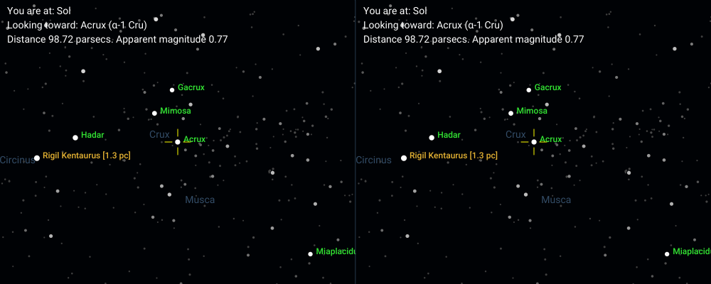
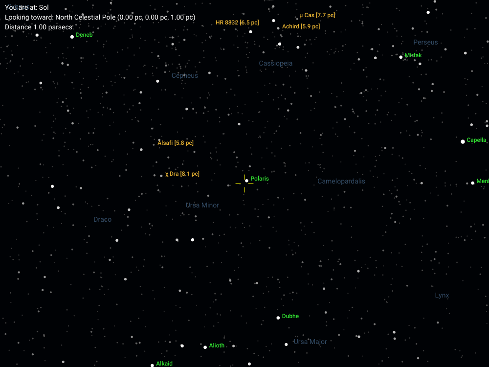

# User Configuration Field+Value Details

Every user-settable configuration value in `config/main.yaml` is described here. Both the purpose of the configuration item as well as its default value (if missing from `config/main.yaml` or not set to a valid value). 

All of these configuration items can also be set in a "preset" file. Preset files are "prefab" collections of configuration items that are widely useful. Using a preset means not having to reenter a bunch of commonly used configuration items each time. For more details about preset files, see _Presets (predefined configurations)_ below.

## Basic values

These are ones you are likely to change regularly. 

- `from`: A name or ID for the star to view from. This is the chart's "viewpoint" -- the point in space where the virtual camera lives (until it is set elsewhere). 
    - The default value for this option is "Sol" (the Sun).
- `to`: A name or ID for a star to look towards. This will be in the center of the plot. 
    - The default value for this option is "Betelgeuse", a bright star in Orion.
    - Both `from` and `to` support setting custom coordinates for these two points instead of identifying a star by name or ID. See "Custom viewpoint and target configuration" below for more details.
- `chartname`: The name you want to save your chart to in the `charts` directory. The `chartname` should be the name minus the `.png` or `.jpeg` extension. If this value is missing or empty, `uraniborg` will use `output.png` for the file name. 
    - The default is no custom chart name (chart saved to `output.png`).
    - Allowed file name characters are limited to letters, numbers, dashes ("-") and underscores ("_"). 
- `preset`: The name of a custom list of configuration options. 
    - Preset names correspond to a file in `config/presets`. If you set, for example, `preset: example`, `uraniborg` will look for the file `config/presets/example.yaml`.  
    - The default value for this option is no preset, meaning no preset file will be used.
- `scheme`: The name of a chart style scheme (sets things like colors and fonts) to use with the chart.
    - The default value is no specific scheme, meaning a default scheme will be chosen.
    - See ["SCHEMES.md"](./SCHEMES.md) for more information about schemes.

## Chart star details

These values control the number of stars shown on the chart, as well as the labels used for them.

- `magnitude`: The visual magnitude limit for the chart. 
    - The default value for this option is +5.5, corresponding to the naked-eye sky from a semi-dark site (Bortle 4 to 5).
- `magnitudelabel`: Stars brighter than (smaller numbers) this limit get a name/ID label on the chart. Labels start with proper names (like 'Rigel' or 'Polaris') when available, and then progress through various labeling schemes, starting with the historical (like Bayer Greek letter designations) and continuing through the modern (like Tycho-2 and Gaia IDs), using the first one found.
    - If this field is missing, or set to exactly zero, the chart instead labels all stars with a proper name (e.g. Rigel, Polaris). 
    - The default value is 0.0, so by default all stars with a proper name are labeled.
- `distancelabel`: Stars closer to the `from` star than this limit get a name + distance label on the chart. 
    - The default value for this option is 10 parsecs (about 32.6 light years). 
- `lightyears`: By default, all charts display distances in parsecs, the same unit that `uraniborg` uses internally for calculations. If `lightyears` is set to `true`, all displayed distances will be in light years instead.
    - The default value for this option is `false`.
    - If `lightyears` is set to `true`, the `distancelabel` will also be interpreted as a distance in light years, for consistency, so be sure to update its value if needed. 

## Chart dimensions

These values control the size and shape of a chart.

- `scale`: A "magnification" level for the chart. The field of view of a typical chart (with an aspect ratio of 4:3) is approximately 90 / `scale` degrees. 
    - The default value for this option is 1.0.
- `width`: The width of the output image file in pixels. 
    - The default value for this option is 1024. 
- `aspect`: The aspect ratio (width / height) as a decimal.
    - The default value for this option is 1.3333 (4 : 3 ratio). 

## Stellar motion options

These values are needed to show what the sky looks like at different times in the far past or future.

- `time`: Indicates time before or after the star chart epoch (2000.0) in years. Star positions will be calculated for the specified `time` before (if negative) or after (if positive) the epoch. 
    - The default value for this option is 0.
    - Decimal (floating point) values are fine here, e.g. `time: 100.5`.
    - This configuration item interacts with `motions` (see below).
- `motions`: Controls whether stars, after calculating updated positions for a far past or future time, are drawn in the new positions (`false`) or have indicator arrows drawn from their present positions (`true`). 
    - The default value for this option value is `false`. 
    - This configuration option has no effect if `time` is missing or set to 0. 

## Additional chart details

These control other features of the chart, such as additional text or markers. 

- `highlight`: This is a CSV list of star names or catalog IDs to highlight (with a distinct color of label) on the chart. All stars with a name or ID that can be looked up in the active data source will be added to the chart. 
    - The default is no items to highlight (no names specified in configuration).
- `coordinates`: When set to `true`, adds a coordinate grid to the chart. The grid corresponds to either equatorial coordinates (right ascension and declination) or galactic coordinates (defined by the plane of the Milky Way galaxy), depending on the value of the `galactic` configuration item. 
    - The default value is `false` (no grid drawn).
- `galactic`: When set to `true`, toggles the plot orientation to galactic mode. In this mode, the vertical (y) axis corresponds generally to galactic latitude and the horizontal (x) axis to galactic latitude.
    - The default value is `false` (plot orientation corresponds to equatorial coordinates, as in most conventional star charts).
- `constellations`: When set to `true`, draws the names of the 88 official constellations close to their centers, as seen from Earth. This is a guide to familiar constellations from close to Earth, but is also a way to orient yourself in a literally alien sky far from Earth, even if a bunch of the stars have moved from their usual places.
    - The default value is `false` (no constellation names drawn).
    - Two constellations get an additional label. Hydra, because it is extremely long, gets one label near each end (western and eastern). Serpens, because it is disjoint (2 separate areas of the sky on either side of Ophiuchus), has a label in each disjoint section.
- `legend`: Controls whether the chart legend (currently showing stellar magnitude symbol ranges) is displayed. 
    - The default value for this option is `false` (no legend drawn).
- `labeltype`: Controls amount of detail in star labels, ranging from 0 (just a single name) to 3 (up to three names or IDs). This field must be an integer. 
    - The default value for this option is 0.
- `projection`: The map projection to use. This field must be an integer. 
    - The default value for this option is 2 (stereographic projection), which is suitable for most chart scales and types. 
- `stereo`: When non-zero, splits the chart into two, with each chart having a suitable stereo offset for the stars shown on it. Positive values work for "cross-eyed" viewing and negative ones for "wall-eyed" viewing.
    - The default value for this option is 0 (no stereo effects)
- `imageformat`: Sets the format for image output to be something other than PNG. Currently, only JPEG is supported as an alternative, enabled by setting `imageformat` to `jpeg` or `jpg`. 
    - The default value for this option is `png`. Any value other than `jpg` or `jpeg` will be set to `png`.
# Starting Configuration Walkthrough

The starting configuration contains `preset: mag_6`. The configuration set by the `mag_6` preset is:

- `magnitude: 6.0` : Stars to visual apparent magnitude +6.0 will be drawn.
- `magnitudelabel: 2.0` : Stars equal to or brighter than magnitude +2.0 will be labeled.
- `scale: 0.75`: The chart's magnification level is 0.75x the default (i.e., slightly wider)
- `projection: 2`: The chart uses stereographic projection for the map.

All the values omitted from the preset will revert to default values. For example, `width` will default to 1024 pixels, all the true/false items under "Additional chart details" above will be `false`, and so on.

# Configuration item "priority"

Configuration items are applied in this order. Items occurring earlier in this order have priority over ones later on:

1. The main configuration file (`config/main.yaml`).
2. A value defined in a preset used by the main configuration file
3. A default value set in `config/default.yaml`.

So, for example, if you load a preset with a `magnitude` of 5.0, and then set `magnitude` = 7.0 in the main configuration file, the final `magnitude` value used by `uraniborg` will be 7.0.

# Advanced / more detailed information about specific configuration items

There are a few fields that benefit from some additional explanation.

## Presets (predefined configurations) set with the `preset` configuration item

Preset configuration collections can contain any of the configuration options listed here except for `preset`. In other words, presets don't "nest" and can't refer to other presets as part of their configuration. The `preset` field will be ignored if specified in a preset configuration file.

There is a more detailed description of available presets in the DETAILS.md file under "Presets". 

## Stereo charts with the `stereo` configuration setting

When this is set to a nonzero value, `uraniborg` will draw a pair of star charts with a stereo offset between them. The size of the offset for each star is equal (in pixels) to the `stereo` configuration divided by the star's distance (in parsecs). For example, with the `stereo` parameter set to `100`, a star 20 parsecs away would be offset 5 pixels to the left in one chart and 5 pixels to the right in the other.

Positive values of `stereo` lead to a "cross-eyed" version of the chart. Negative values reverse the sense ("wall-eyed" mode).

Stellar annotations (such as labels and proper motion arrows) will be offset similarly to the star itself. In the case of proper motion arrows, the stereo offset is based on the correct position of the star at the time indicated (so if the star approaches the Earth in the time frame of interest, the offset of the arrowhead in each chart will be larger than that of the star itself).

Because of the way coordinate grids are generated, they are not currently supported when `stereo` is non-zero. All other chart-level annotations, like constellation names and the information caption, are supported.

Below is an example of a chart with `stereo` set. This shows the region around Crux, the Southern Cross, adding enough `stereo` separation to make Alpha Centauri (IAU proper name: Rigil Kentaurus) stand out in stereo view:

```
from: Sol
to: Acrux
constellations: true
stereo: 10
width: 1000
aspect: 2.5
scale: 1.75
preset: mag_6
```

The resulting chart is:



Note that the `width` and `aspect` parameters apply to the entire image. Each subchart in the stereo pair has a width equal to one-half the `width` parameter and an aspect ratio equal to one-half the `aspect` parameter.

## Custom viewpoint and target configuration (advanced use of the `from` and `to` configurations)

The `from` and `to` fields can accept coordinates instead of star names or IDs to identify a location of interest.

### Option 1: Cartesian coordinates for a 'from' or 'to' value

Instead of a star name or ID to look up, you can set a CSV list of 4 values that defines a location in space, for either the `from` or the `to` field. The CSV format values are, in order:

1. A name or label for the custom point (can be anything that does not contain ",")
2. The point's x-coordinate
3. The point's y-coordinate
4. The point's z-coordinate

The coordinate system is the same as that used for star objects: 

- the units are parsecs by default (light years if the `lightyears` field is set to `true`)
- the origin is (very close to) the Sun
- the coordinate system has the positive x-axis towards the vernal equinox in the epoch J2000.0, the positive z-axis towards the north celestial pole (near Polaris), and the positive y-axis at right angles to the other two (to be specific, to J2000.0 right ascension 6 hours, declination 0 degrees). 

Example configuration looking from the Sun towards the north celestial pole in the year 2000 (not far from Polaris):

```
from: Sol
to: North Celestial Pole, 0.0, 0.0, 1.0
magnitude: 6.5
scale: 0.75
magnitudelabel: 2.0
constellations: true
width: 1000
```

The result looks like this:



### Option 2 (for the 'to' field only): Equatorial coordinates (right ascension and declination)

The `to` field can also specify a direction in space, rather than a specific point. The format for this is a CSV list of 3 values that defines a location in space. The fields are, in order:

1. A name or label for the custom point (can be anything that does not contain ",")
2. The right ascension to look towards, in _hours_ 
3. The declination to look towards, in degrees

This option is only available for the `to` value. 

Using this option, the North Celestial Pole example from above would take this form:

```
from: Sol
to: North Celestial Pole, 0.0, +90.0
magnitude: 6.5
scale: 0.75
magnitudelabel: 2.0
constellations: true
width: 1000
```

### Notes

Only the single-name and the CSV-field formats are supported for `from` and `to` (3 coordinate values for `from`, 2 or 3 values for `to`), and if the coordinate fields are present, all of them must be numeric. Other formats for the field will fail validation, and a new chart will not be created.

## Map projections (the `projection` configuration item)

This is a configuration setting that is a bit less likely to need routine changing than the others. There are 4 available projections, each identified by an integer:

- 1 = orthographic
- 2 = stereographic
- 3 = polar azimuthal equidistant
- 4 = Lambert equal-area azimuthal

The default is stereographic, setting `2`, because it preserves constellation shapes (at the expense of distorted size at large angles). 

Some smaller-area (large `scale`) presets use orthographic projection (setting `1`), because it is slightly faster to compute, but is not suitable for larger areas. 

The `nearby_1` and `nearby_2` presets use the equal-area azimuthal projection (setting `4`), because it can display the entire sky, at the cost of fairly severe shape distortion near the edges. Equal-area projections also preserve the overall star "density" of a region of sky, so it's easy to identify the regions of the sky that look the brightest or which have the most stars overall (like near the center of the Milky Way). The use case for those presets is to quickly identify prominent nearby stars throughout the sky, all at once. It's always possible to then change to a different projection to get a more realistic chart of a specific part of the sky.

