## A Walkthrough for User Configuration

### Getting Started

All user-configurable aspects of `uraniborg` are controlled by files formatted in YAML (https://yaml.org/). For most files you'll use in `uraniborg`, this format is simply a list of attribute names and values, separated by a colon, like this:

```
name: Hazel
type: cat
is_furry: true
tail_count: 1
tail_length: 1.85
```

As you can see, common types of data, such as plain text, integers, decimal (floating point) numbers, and true/false (Boolean) values are all supported.

You create a new chart by updating the configuration items in `config/main.yaml`. `uraniborg` monitors this file for changes and renders a new chart every time the file is saved or changed on disk.

Any configuration that `uraniborg` doesn't recognize will get a default value. The exact values are described in the main README. If you enter invalid YAML, `uraniborg` currently generates a chart from all of those default values, so if you get a chart that doesn't look like what you expect from your input, check to be sure your input YAML is correctly entered.

### Your First Chart

We'll start with some charts for the area near 61 Cygni. The star 61 Cygni is a suitable first target because it's famous for being (1) the first star to have its distance accurately measured, and (2) for being one of the most rapidly-moving stars visible to the naked eye.

Edit `config/main.yaml` so it reads:

```
from: sol
to: 61 cyg
preset: mag_6
```

This particular preset, `mag_6`, will show stars down to magnitude +6.0 (naked eye from a moderately dark sky) and a moderate chart size. It's a good starting point for many charts.

Start Uraniborg from the main project directory, if it isn't already running:

`./uraniborg`

It will take a few seconds to start up and load data, then it will generate the chart, which will be in the file `charts/output.png`. It will look like this:

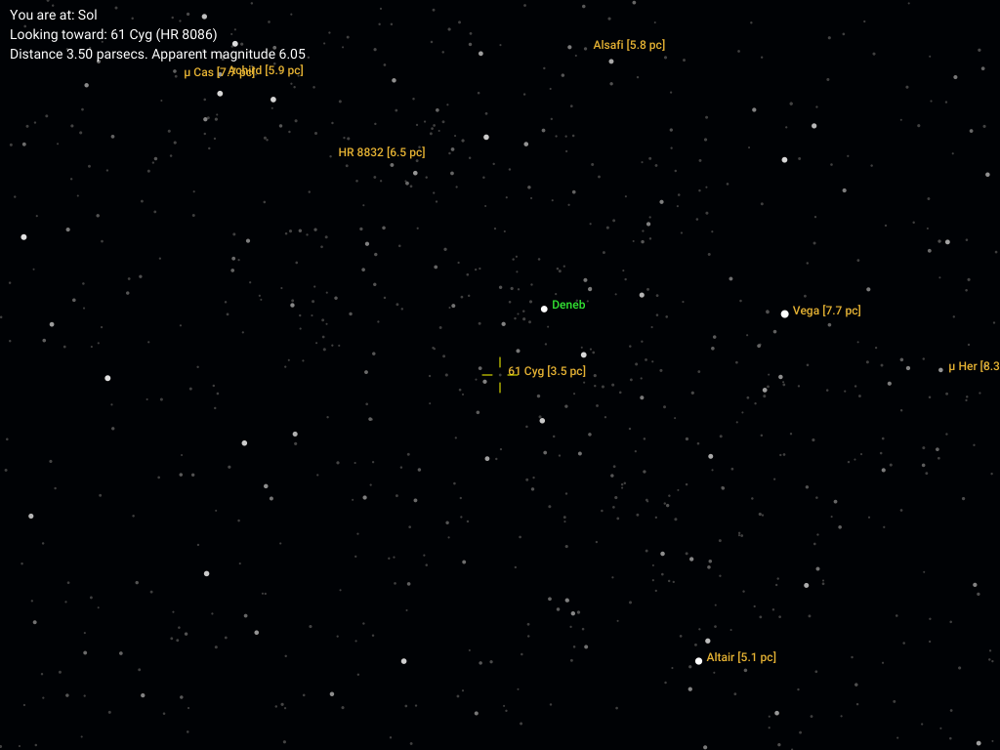

61 Cygni is in the chart center. The other stars of Cygnus are nearby, and you can see some of the other nearby constellations, like Delphinus (below and slightly right of 61 Cygni), Lyra (with the bright star Vega, to the right and slightly above 61 Cygni), and Pegasus, with the Great Square of Pegasus visible in the lower left of the chart.

This view shows some of the standard features of the chart, for most configurations:

- nearby stars (within 10 parsecs, or about 33 light years) get an orange label
- relatively bright (but not nearby) stars get a green label
- the chosen "To" star is centered.

Note that once the initial data load is done, all the star data is in memory and successive charts will render much more quickly. So leave `uraniborg` running and just edit the configuration file for each of the following examples.

### Changing the location

Edit `config/main.yaml` to switch the two stars:

```
to: sol
from: 61 cyg
preset: mag_6

```

The output will look like this:

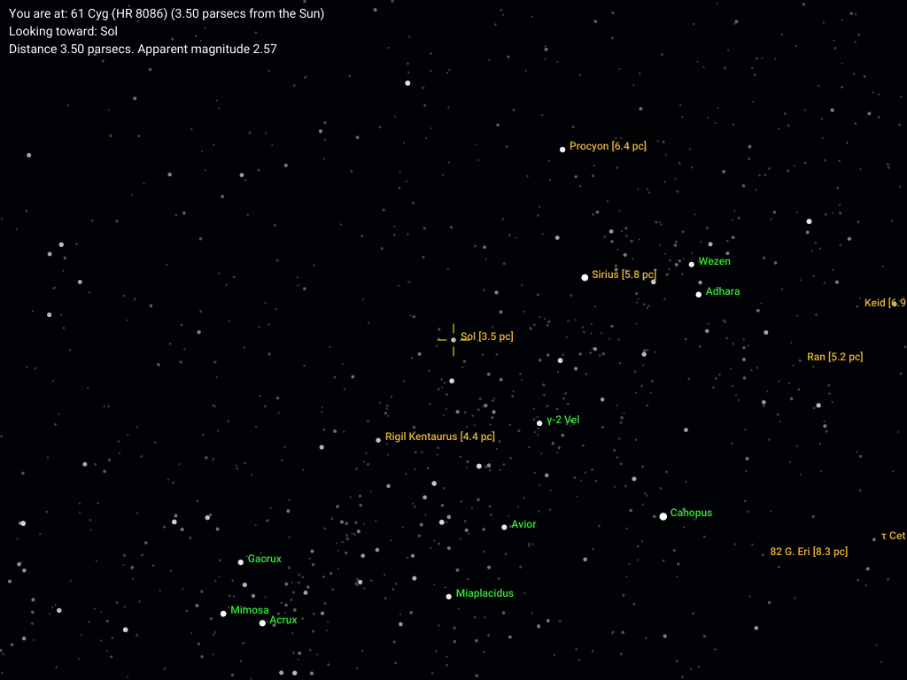

You can see that the Sun, as seen from 61 Cygni, is in the southern Milky Way, between Canis Major and Crux. But, as you might guess, the constellations are distorted a bit -- Crux has lost its cross shape, and Sirius, which is relatively close to the Sun, has moved away from its familiar spot in Canis Major.

### Changing star brightness ranges

Edit `config/main.yaml` to go back to the Sun, but then add a `magnitude` that is quite a bit dimmer (larger number) than the +6.0 used in the `mag_6` preset configuration:

```
from: sol
to: 61 cyg
preset: mag_6
magnitude: 7.5

```

And look at the chart:

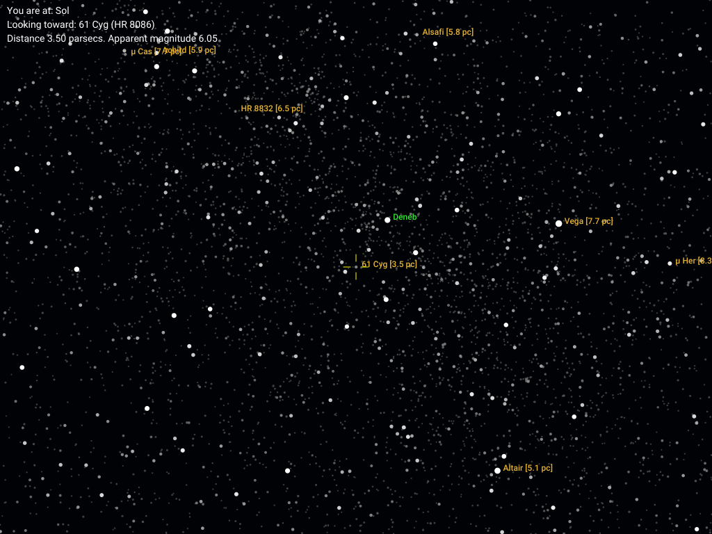

There are many more stars -- you can even see generally where the Milky Way runs now. 

Note that the custom value of 7.50 for `magnitude` overrode the prefab magnitude limit of +6.0 from the preset. This is general: you can always customize a configuration that's been set up initially with a preset.

### Changing the timeframe for things

Go back to `config/main.yaml` and remove the updated `magnitude`. Also add a `time` field for 5000.0 years in the future (so for 7000.0 CE), and a `motions` field equal
to `true` to enable the star motion labels:

```
from: sol
to: 61 cyg
preset: mag_6
time: 5000
motions: true

```
Then save the updates and look at the updated chart:

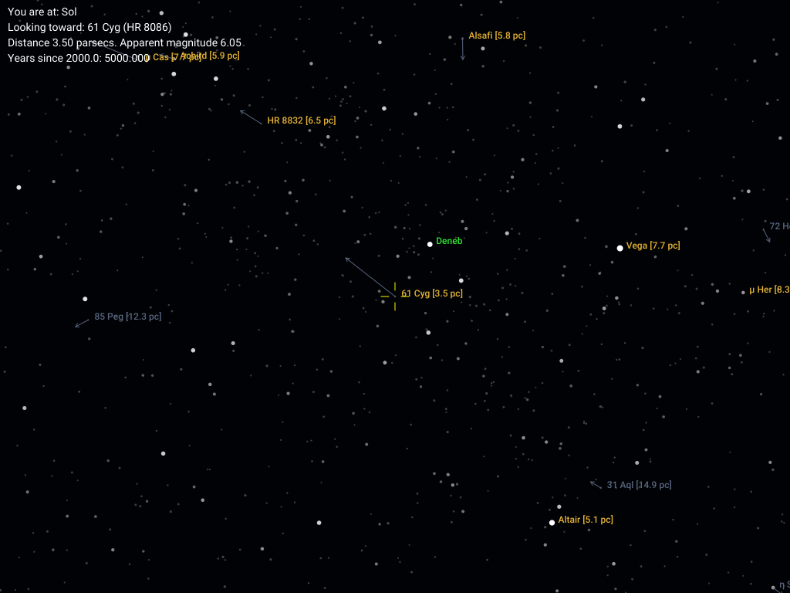

You can see the stars with significant motion in this time frame; they have that motion marked with an arrow pointing to the final position of the star. Stars with motion arrows always get a label (here, in gray, if not already labeled otherwise). 

If instead, you simply wanted to draw the stars as they appear in 7000 CE, without any additional markers, set `motions` to `false`:

```
from: sol
to: 61 cyg
preset: mag_6
time: 5000
motions: false

```

Save your config and view the chart:

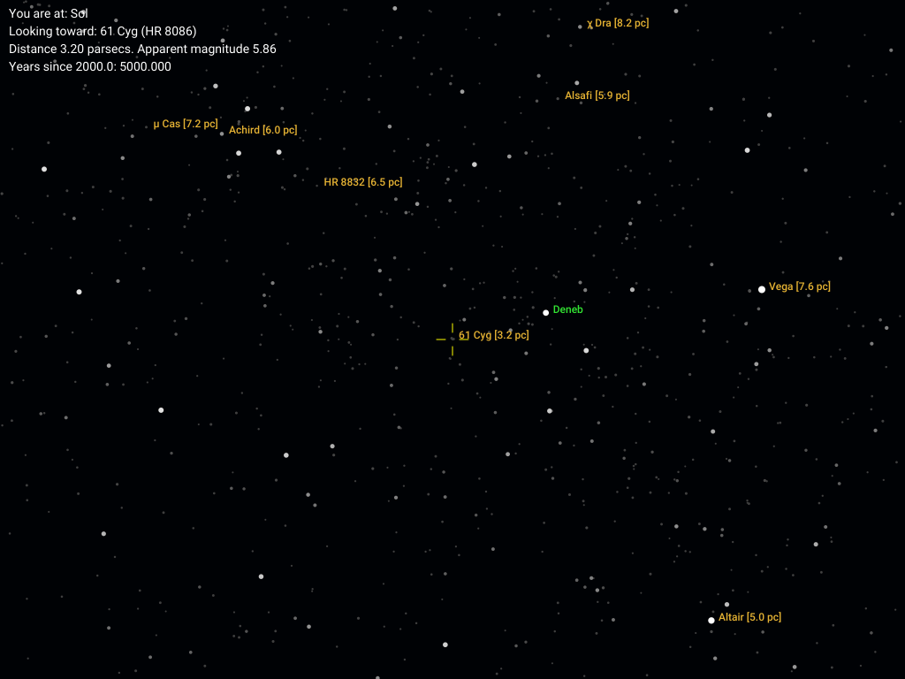

Here, the stars are drawn as they appear in 7000 CE; compare with the immediately previous chart to see all the major differences.

### Changing the label limits

Remove the time settings (`time` and `motions`) from the config, and add a `magnitudelabel` and a `distancelabel` to label more stars. Here, we'll set the magnitude limit to be a little fainter (+3.0 instead of the preset's default of +2.0), and the distance label limit to be a bit further away (13 parsecs -- about 40 light years -- instead of 10):

```
from: sol
to: 61 cyg
preset: mag_6
magnitudelabel: 3
distancelabel: 13

```

Save, and look at your chart:

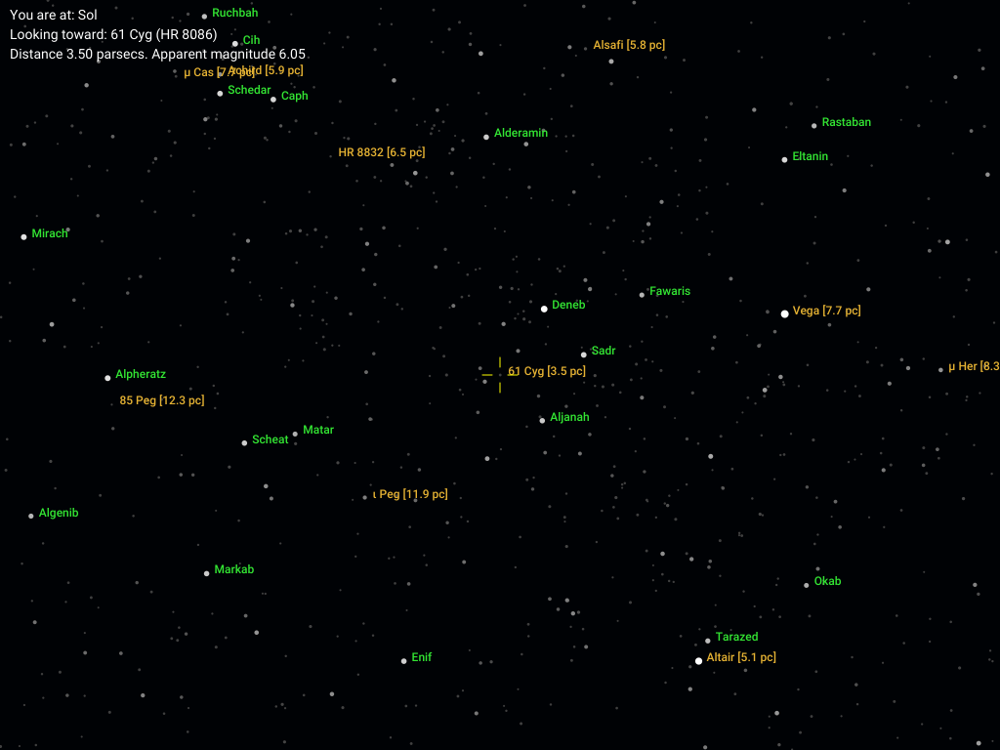

You can now see many more stars (such as the ones in the Great Square of Pegasus on the left) have regular bright-star labels, and many more stars (the ones between 10 and 13 pc) now have distance labels.

### Adding additional labels

You can display a few other chart annotations through the configuration. The `constellations` setting enables or disables constellation name labels, and the `coordinates` setting enables or disables a grid showing the coordinate system used by the chart.

Edit the configuration file and set both of these settings to `true`:

```
from: sol
to: 61 cyg
preset: mag_6
magnitudelabel: 3
distancelabel: 13
constellations: true
coordinates: true
```


Save, and look at your chart:

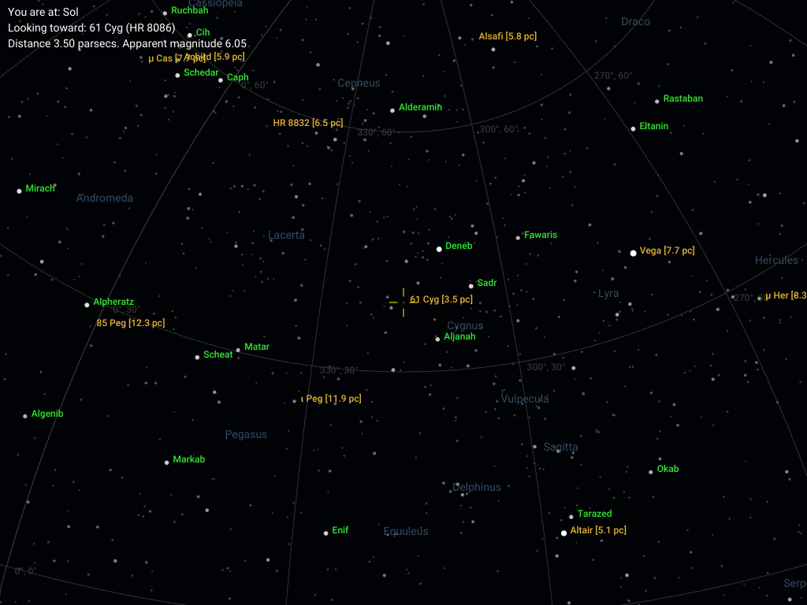

### Showing galactic instead of equatorial coordinates

By default the `coordinates` setting turns on an equatorial coordinate grid (right ascension and declination). The `galactic` setting, when set to `true`, changes the coordinate system for the chart to galactic coordinates instead of equatorial ones.

Edit the configuration file and add a `true` setting for `galactic`:

```
from: sol
to: 61 cyg
preset: mag_6
magnitudelabel: 3
distancelabel: 13
constellations: true
coordinates: true
galactic: true
```

Save, and look at your chart:

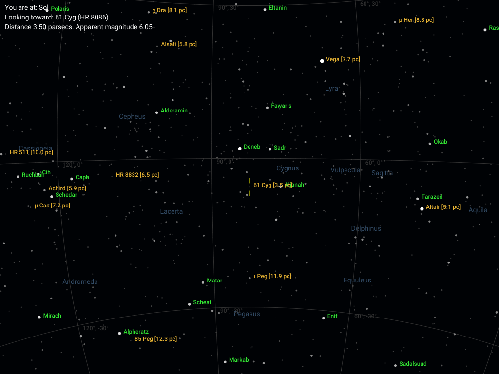

You can see how Cygnus lies almost exactly along the galactic equator (galactic latitude = 0 degrees).

### Changing the scale

Scale changes the amount of sky shown at a time. You can think of it as a magnification factor: doubling the scale roughly doubles the size of a group of stars on the chart, while covering half the previous chart's width and height on the sky. 

For this one, we'll go back to a simpler set of labels. Edit the user config to delete the constellation names and the coordinate grid, and reomve the `galactic` setting, so we are back to using equatorial coordinates as a basis. Then set a `scale` of 2.0. The preset value from `mag_6` is 1.0, so this will double the apparent size of things:

```
from: sol
to: 61 cyg
preset: mag_6
magnitudelabel: 3
distancelabel: 13
scale: 2

```
Save, and look at your chart:

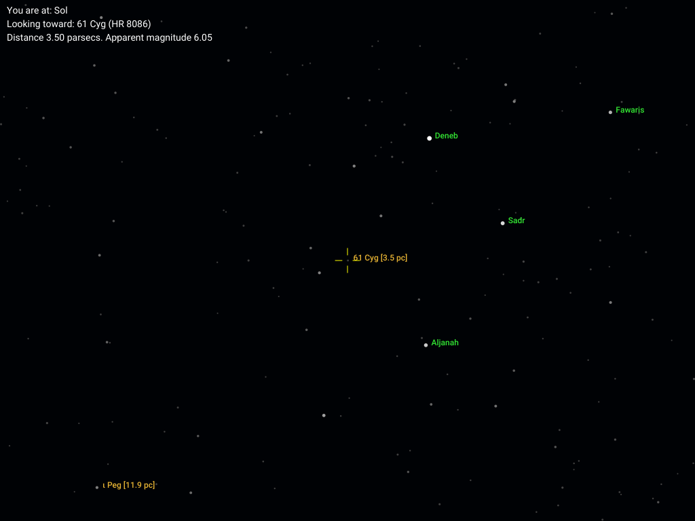


### Change label details

The configuration setting `labeltype` adjusts the amount of detail shown in the star labels. The value in most presets is 0, which is the "base" level of just a single name or ID.

Let's increase this to level 2, which will show 2 separate IDs on different lines:

```
from: sol
to: 61 cyg
preset: mag_6
magnitudelabel: 3
distancelabel: 13
scale: 2
labeltype: 2

```
Save, and look at your chart:

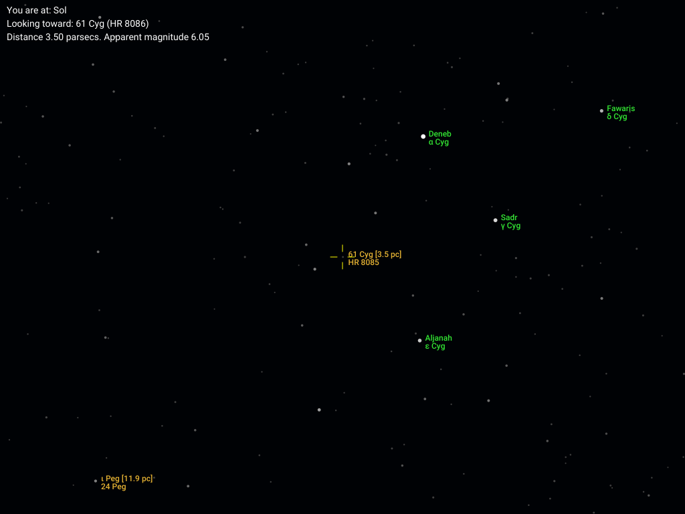

Note that each star now has its original name or primary label, along with an additional label. The label "hierarchy" goes from more "traditional", like proper names and Bayer Greek letter designations, to more "modern", such as HIPPARCOS or Tycho catalog IDs.

### Change chart attributes

Both the chart width and the chart aspect ratio (which also defines the height) can be set in your config. Let's create a smaller chart (800 pixels wide) with a wider aspect ratio (1:1, or 800x800 pixels):

```
from: sol
to: 61 cyg
preset: mag_6
magnitudelabel: 3
distancelabel: 13
scale: 2
labeltype: 2
width: 800
aspect: 1
```
Save, and look at your chart:


### Save it as a preset

This chart configuration has been heavily customized. Let's suppose you want to revisit it later but don't want to sort out all of these steps from scratch.

Save your `main.yaml` as a .yaml file in `config/presets`. Let's call it `61cygni_1.yaml` for now. From a terminal window in the `uraniborg` main directory:

`cp config/main.yaml config/presets/61cygni_1.yaml`

Then edit your user_config file to read simply:


```
preset: 61cygni_1  
```

That is, just use the name of your preset file minus the `.yaml` ending. 

Save, and look at your chart. It's the same as before:

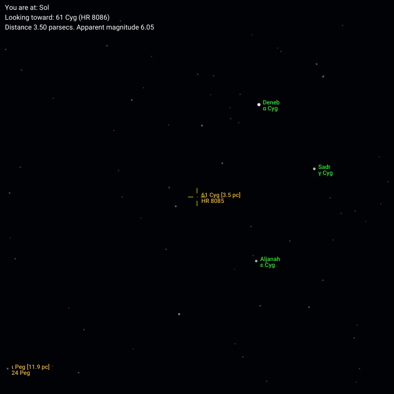

### Reuse your preset and override a specific item

Just to be sure that we aren't simply recycling the old chart, let's change just the "to" star -- the one being centered on -- to anything else, like Betelgeuse in Orion:

```
preset: 61cygni_1
to: Betelgeuse
```
Save, and look at your chart:

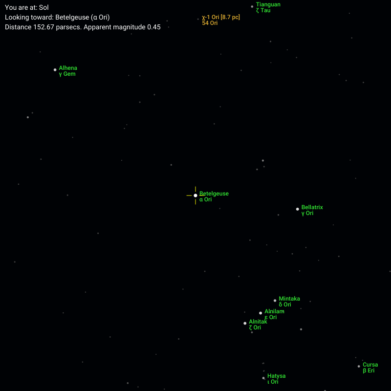

All the preset items -- label settings, chart size and aspect ratio, etc. -- are still preserved.

### Next Steps

At this point, you should have enough information to make lots of your own charts. I've collected some more advanced and esoteric details in the file DETAILS.md in the main directory. Look here for more details about each of the presets.