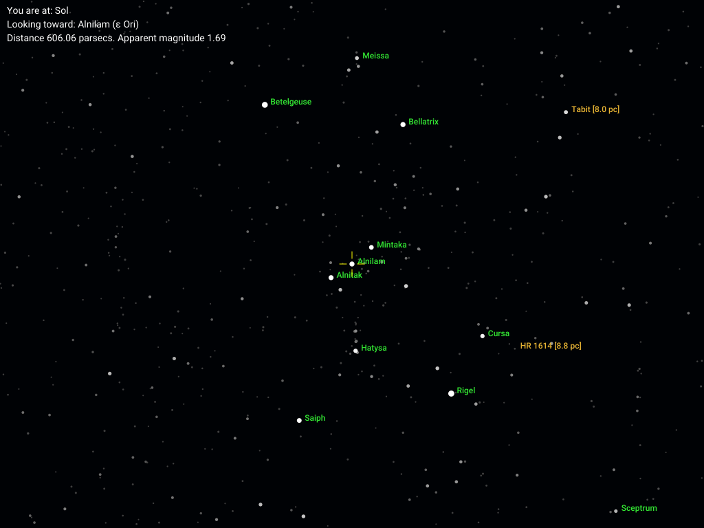
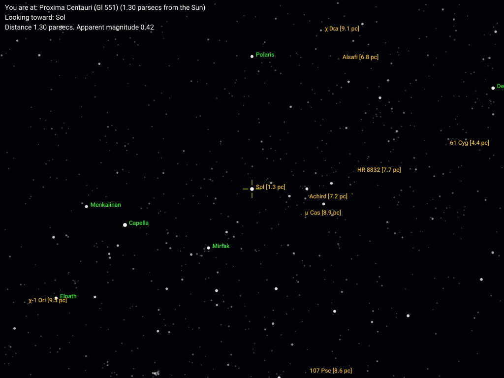
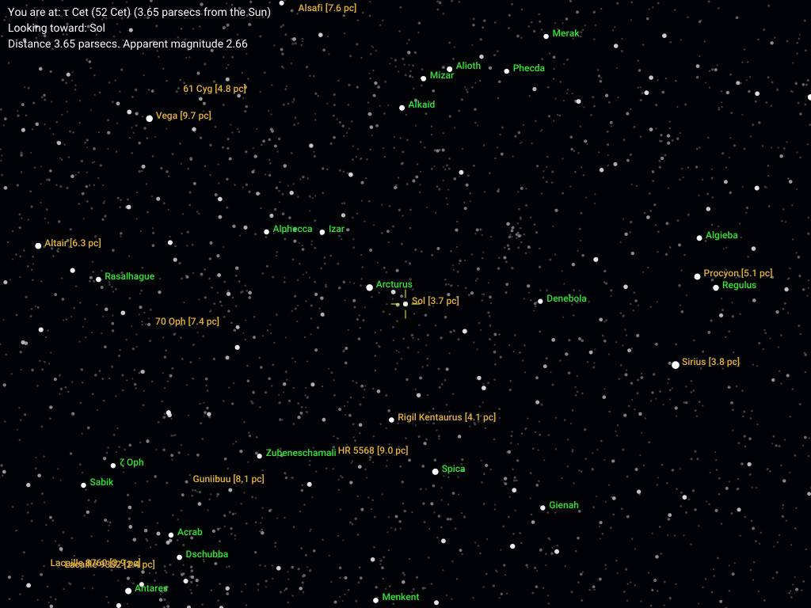
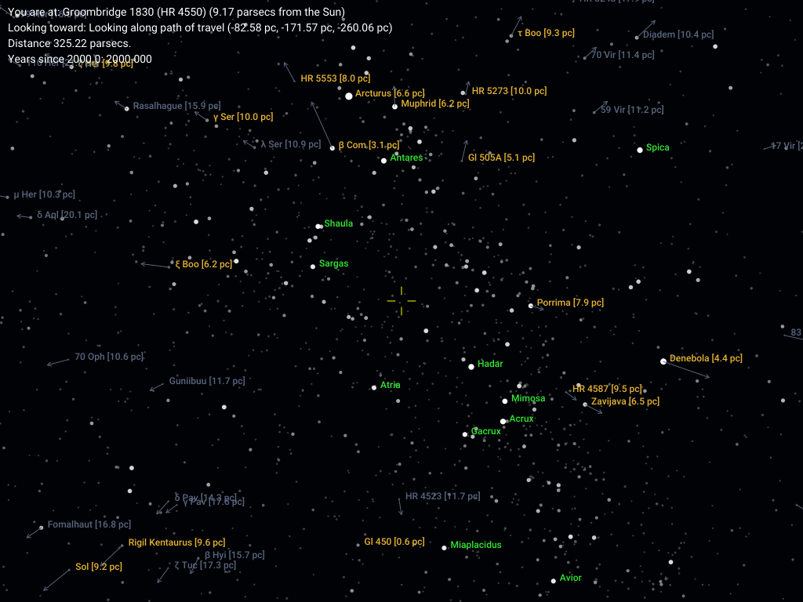
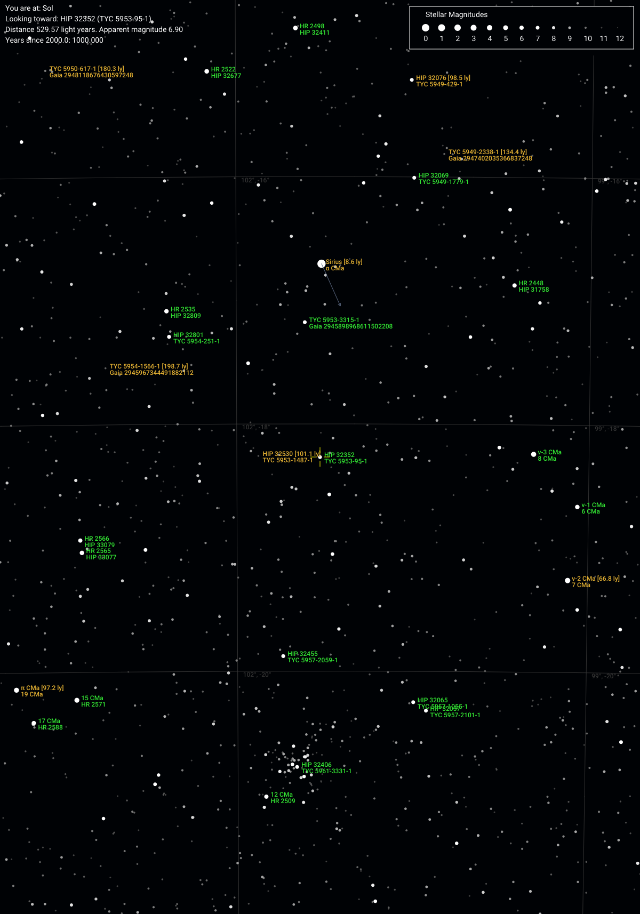
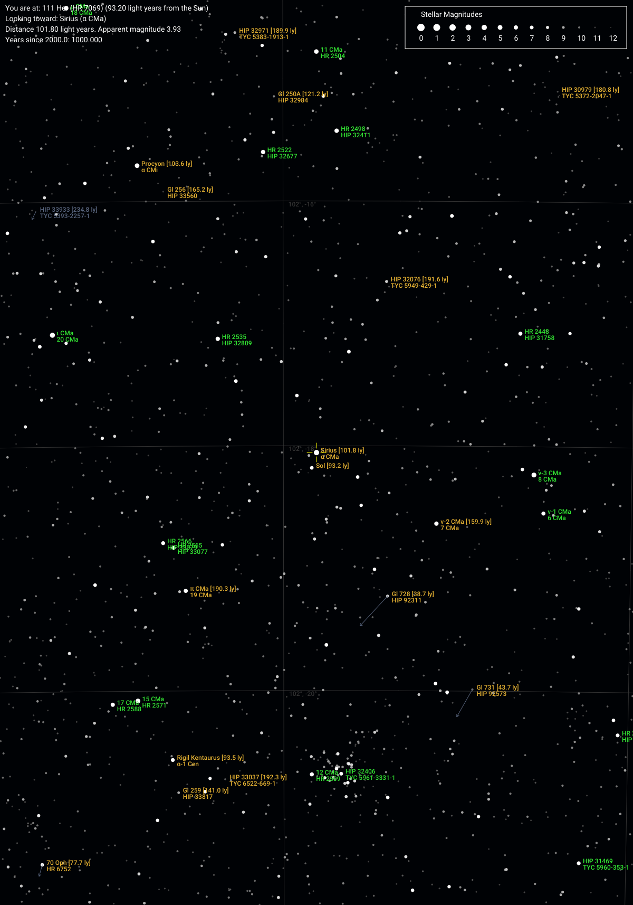

## Sample Charts

Some example charts generated by `uraniborg`. The user configuration files for these samples are in the directory `samples/configs`.

1. Orion and nearby parts of the sky, as seen from Earth.

2. The Sun from Proxima Centauri, the nearest star:

3. Wide-field view of the sky from Tau Ceti, looking back at the Sun.

4. Region around 61 Cygni in 10,000 CE (8,000 years after the chart base epoch), with stars' positions at that time marked, showing how much more rapidly 61 Cygni moves compared to other stars in the area.

.")

5. From the very rapidly moving star Groombridge 1830 (HIP 57939), a look along its direction of travel, showing how much the stars appear to move in 2000 years from the present. Many stars move significantly in that time frame (from Earth, only a few stars, one of them Groombridge 1830 itself, behave similarly), and all the moving stars appear to be receding from the same (very small) area, illustrating how rapidly Groombridge 1830 is traveling compared to other stars in the general area.

6. Sirius (top center) and the star cluster M41 (bottom center) from Earth, with chart parameters set to resemble the _Millenium Star Atlas_ (stars to magnitude +12, nearby stars labeled to 200 light years or 65.2 parsecs, stellar motions for 1000 years from present shown). 

7. Looking back towards Sirius from 111 Herculis, a star almost directly opposite Sirius in Earth's sky. As a result, the Sun and Sirius are very close together. The scale and magnitude limit for this chart are the same as the immediately preceding one, i.e., similar to the _Millennium Star Atlas_. 

