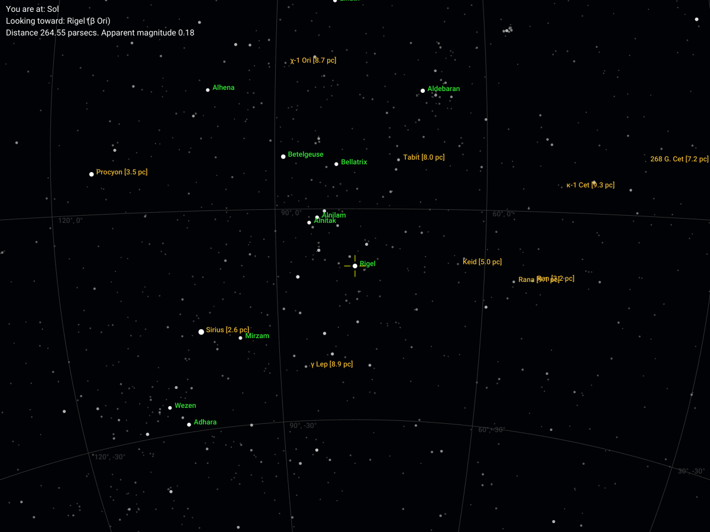
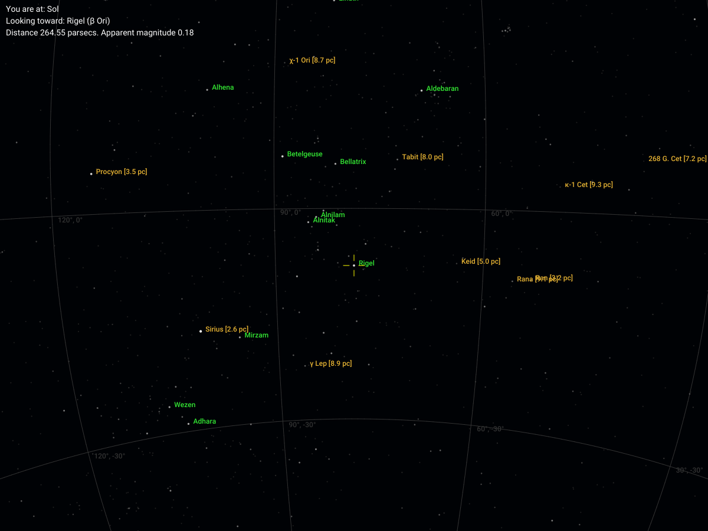
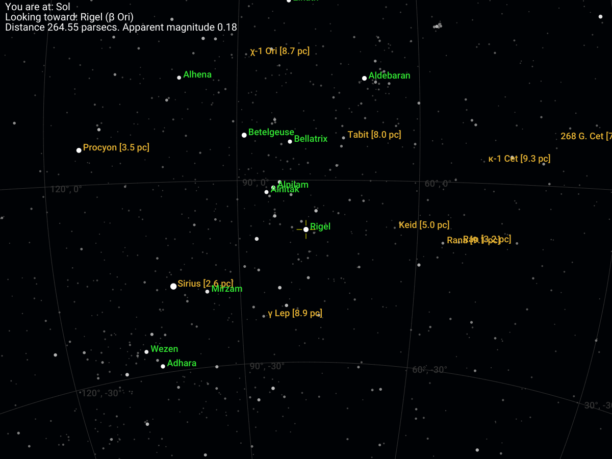
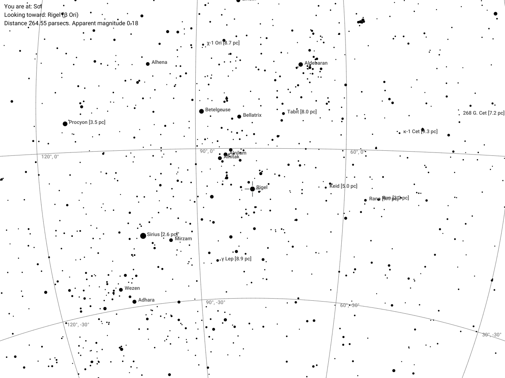
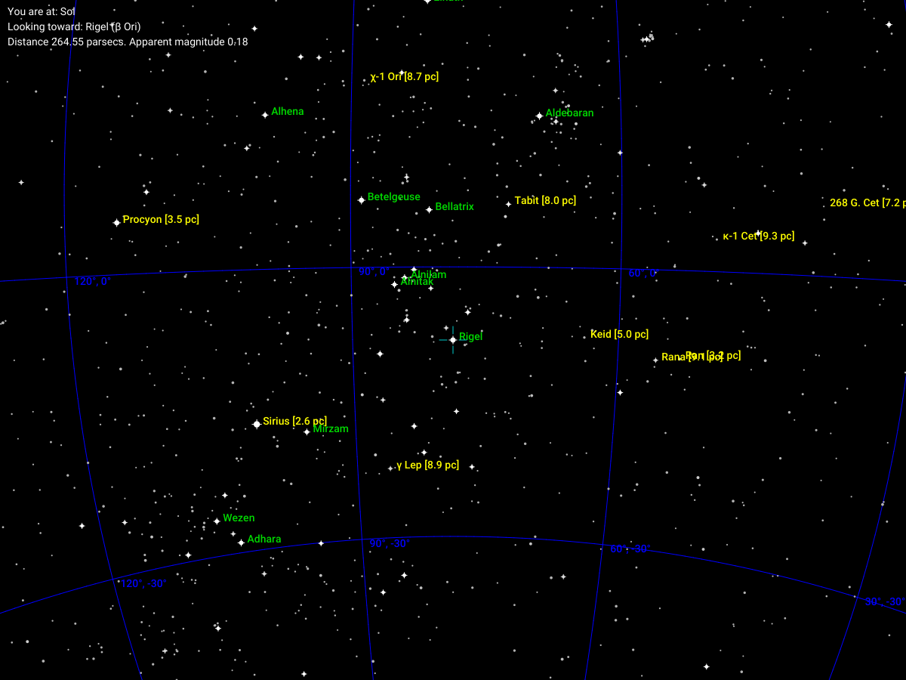

## Scheme Examples

These are examples of the current schemes supplied with `uraniborg`. All of these use the following basic config:

```
preset: mag_6
to: Rigel
width: 1200
coordinates: true
```

with different `scheme` parameters.

1. `scheme: default`



2. `scheme: small`



3. `scheme:large`



4. `scheme: inverse`



5. `scheme: night_vision`

 scheme")

6. `scheme: retro`

